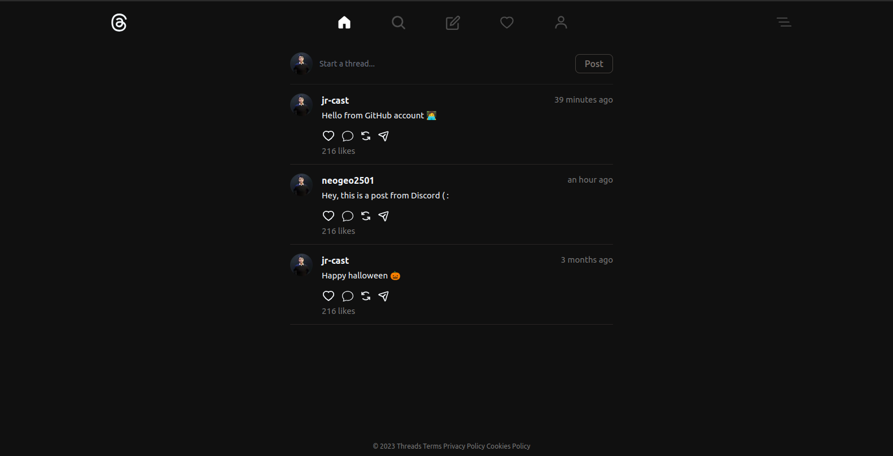

# Threads Clone



## Technologies

- TypeScript
- Nextjs
- TailwindCSS
- Clerk
- tRPC
- PlanetScale

## How to run it locally 🖥️

Clone or fork

```
git clone ssh/https here
```

Go to folder

```
cd threads-clone
```

Create an .env file with keys

```
DATABASE_URL=
NEXT_PUBLIC_CLERK_PUBLISHABLE_KEY=
```

Install dependencies

```
npm install

```

Run project

```
npm run dev

```
